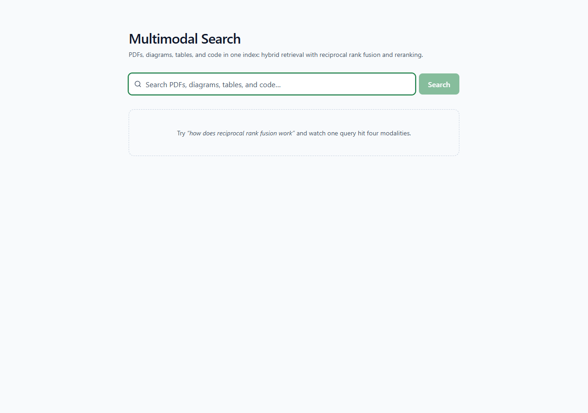
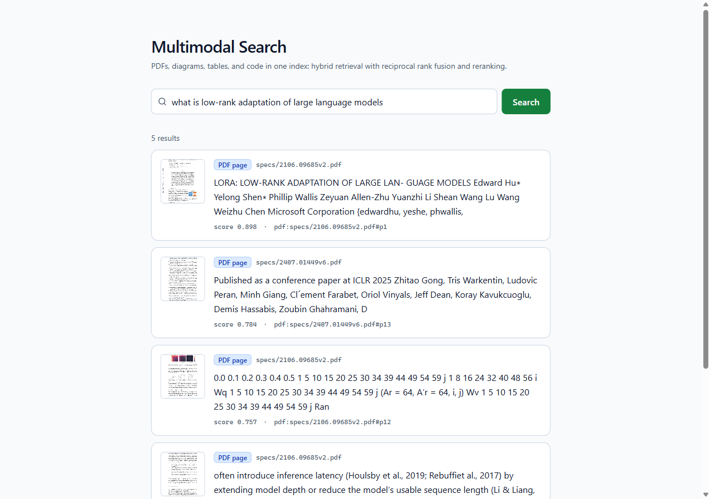
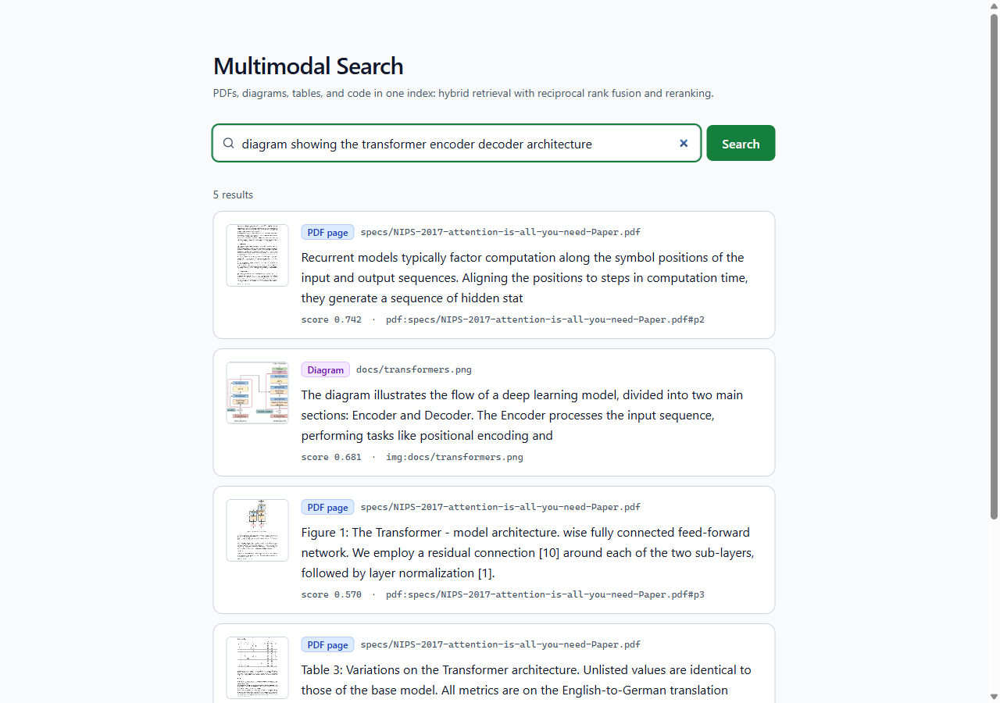
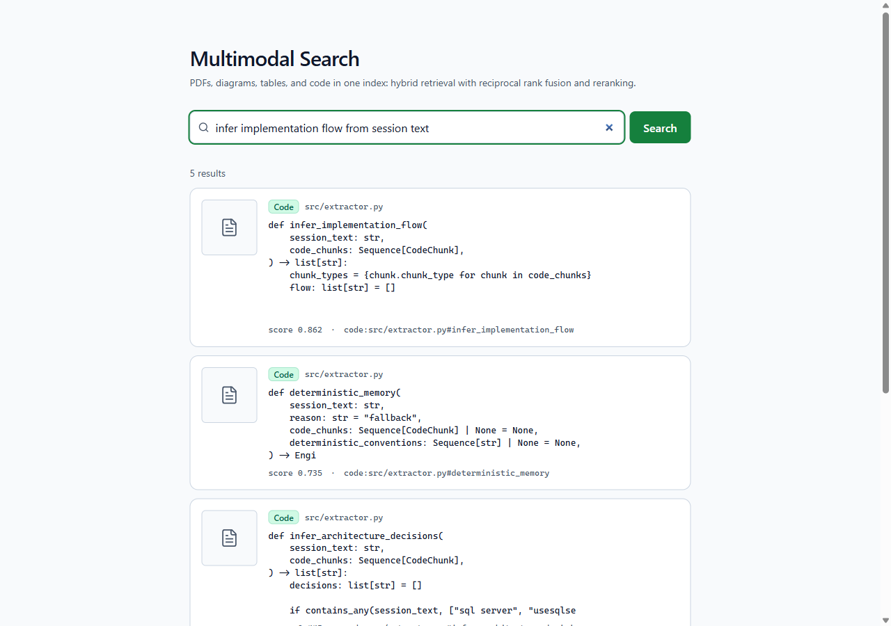
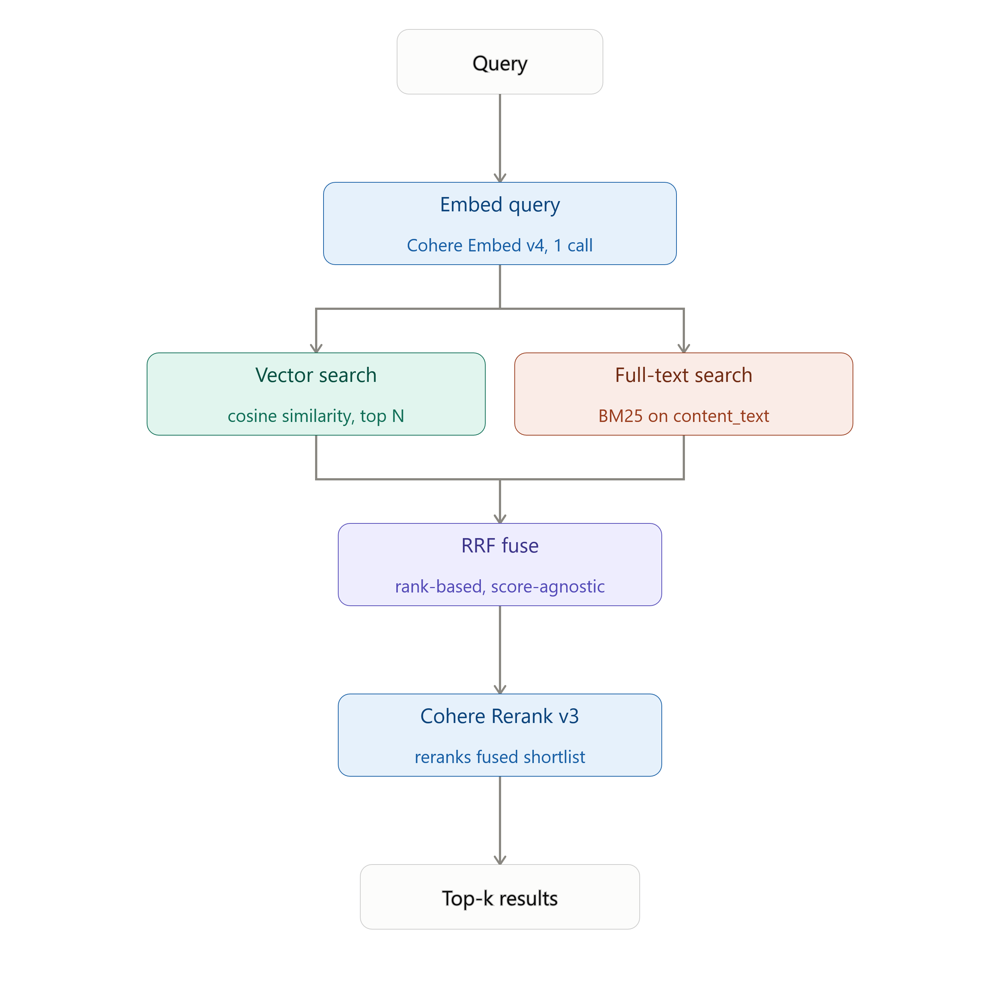

# Multimodal Search for Engineers


A search system that unifies PDFs, diagrams, tables, and code into **one
searchable index**: two embedding spaces (Cohere Embed v4 for page/diagram
*images*, OpenAI text-embedding-3-small for table/code/caption *text*), one
LanceDB table, hybrid retrieval (two vector retrievers + full-text, fused via
RRF) with Cohere Rerank v3 on top. Built to answer a question a
single-modality search tool can't: "which of my papers, diagrams,
spreadsheets, and source files actually talks about this," in one query.

## Screenshots

The idle search page:



A PDF result for "what is low-rank adaptation of large language models":



A diagram result with its thumbnail, for "diagram showing the transformer
encoder decoder architecture":



A code result with the mono snippet, for "infer implementation flow from
session text":



## Architecture at a glance



Query → embed with both providers (Cohere text query-embed, OpenAI text
query-embed) → two vector searches + full-text search (all three against the
same LanceDB table) → three-way Reciprocal Rank Fusion → Cohere Rerank v3 →
top-k results with thumbnails. PDFs and diagrams are embedded as *images*
(ColPali-style, single-vector, Cohere Embed v4) rather than OCR'd text;
diagrams and scanned pages also get a second OpenAI vector over their
VLM caption text. Tables are serialized to markdown and capped at 200 rows;
code is chunked by tree-sitter symbol boundaries (function/class), not
fixed-size splits -- both embedded via OpenAI text-embedding-3-small.
Text-less images (diagrams, scanned pages) get a moondream2-generated
caption so full-text search, the OpenAI vector, and reranking all have real
text to work with. Full design rationale is in [`PLAN.md`](PLAN.md) and
[`EMBEDDING_MIGRATION_PLAN.md`](EMBEDDING_MIGRATION_PLAN.md).

## Setup

```
pip install -e ".[dev]"
```

Build the frontend (requires Node 20+). The UI is a React + Vite app in
[`frontend/`](frontend); its build output is gitignored, so **a fresh clone
serves nothing at `/ui` until this runs**:

```
cd frontend && npm install && npm run build
```

That emits into `src/mmsearch/api/static/`, which FastAPI already serves: no
separate frontend server in production. Design rationale and the dev-server
workflow are in [`FRONTEND_PLAN.md`](FRONTEND_PLAN.md).

Create `.env` at the repo root (see [`.env.example`](.env.example)):

```
COHERE_API_KEY=your-key-here
OPENAI_API_KEY=your-key-here
MMSEARCH_API_KEY=your-own-shared-secret-here
```

`MMSEARCH_API_KEY` gates `/search` and `/thumbnails` -- generate one with:

```
python -c "import secrets; print(secrets.token_urlsafe(32))"
```

The server won't start without it. Opening `/ui` in a browser prompts for the
key on first search and remembers it (`localStorage` + a cookie, so both
`fetch` calls and ``-loaded thumbnails authenticate); calling `/search`
directly needs an `X-API-Key: <key>` header, e.g.:

```
curl -H "X-API-Key: your-own-shared-secret-here" "http://127.0.0.1:8000/search?q=auth"
```

Populate `corpus/` with your own PDFs (`specs/`), diagrams (`docs/`),
tables (`data/`), and code (`src/`). Three files are gitignored by license
or size rather than committed. See [`corpus/README.md`](corpus/README.md)
for exactly which ones, why, and where to source them.

## Running it

```
python -m mmsearch.ingest.cli ingest corpus/
uvicorn mmsearch.api.server:app --host 127.0.0.1 --port 8000
```

Open **http://127.0.0.1:8000/ui** and search. (If that page is blank or 404s,
the frontend build step above hasn't been run.)

To iterate on the UI itself, run Vite's dev server alongside uvicorn. It proxies
`/search` and `/thumbnails` to port 8000 and gives hot reload:

```
cd frontend && npm run dev      # http://127.0.0.1:5173
```

## Deployment

Deployed to Render as a read-only query service over the already-ingested
index -- ingestion stays local, where the API spend and (optionally) the GPU
already are. `data/lancedb` and `data/thumbnails` are committed to the repo
rather than kept on a persistent disk: they're a 9.8 MB build artifact, not
mutable state, and nothing on the query path writes to them. Full rationale,
the Render build/start commands, environment variables, cost breakdown, and
the security posture changes that come with being genuinely public are in
[`DEPLOYMENT_PLAN.md`](DEPLOYMENT_PLAN.md).

## Eval results

Hit-rate@5 against 25 hand-written labels
([`eval/labels.yaml`](src/mmsearch/eval/labels.yaml)) on the real ingested
corpus, measured after the Cohere/OpenAI embedding split
([`EMBEDDING_MIGRATION_PLAN.md`](EMBEDDING_MIGRATION_PLAN.md)), across all
three retrieval modes:

| | vector-only | rrf-only | rrf+rerank |
|---|---|---|---|
| **Aggregate** | 0.880 | 0.920 | 0.920 |
| *per-modality* | | | |
| - code | 0.900 | 0.800 | 1.000 |
| - diagram | 1.000 | 1.000 | 0.750 |
| - pdf_page | 0.714 | 0.857 | 0.714 |
| - table | 0.800 | 1.000 | 1.000 |
| *per-text_source* | | | |
| - code_source | 0.900 | 0.800 | 1.000 |
| - pdf_text_layer | 0.714 | 0.857 | 0.714 |
| - table_markdown | 0.800 | 1.000 | 1.000 |
| - vlm_caption | 1.000 | 1.000 | 0.750 |

(`rrf-only` and `rrf+rerank` measured at `RRF_K=20`, re-validated against
this three-way fusion after the migration -- see `config.py`'s comment for
the controlled k=60-vs-k=20 comparison. `rrf+rerank` was re-measured with
the Cohere rerank calls throttled to stay under the API key's rate limit,
and the run log confirms zero reranker fallbacks -- these are true reranked
numbers, not a silent RRF-order substitution.)

**Headline finding: production mode (`rrf+rerank`) didn't move at all.**
Aggregate hit-rate@5 is 0.920 both before and after the migration, and every
per-modality cell matches exactly: code 1.000/1.000, diagram 0.750/0.750,
pdf_page 0.714/0.714, table 1.000/1.000. The embedding-provider split
achieved its cost goal (table/code/caption-text embedding moved off Cohere
onto the much cheaper OpenAI `text-embedding-3-small`) with **no measured
quality cost** on this eval set in the mode that actually serves `/search`.
The likely reason: Cohere Rerank v3 re-scores the fused shortlist directly
against the query text, which is provider-agnostic -- it doesn't care
whether a candidate's *retrieval* signal came from Cohere-image-space,
OpenAI-text-space, or FTS, only whether the candidate's text is relevant.
That gives the reranker room to correct for whatever the upstream fusion
gets slightly wrong, which is also why `vector-only` and `rrf-only` (below)
did shift while `rrf+rerank` absorbed the difference.

`vector-only` moved (0.960 -> 0.880) and is **not directly comparable** to
the pre-migration number -- and not just because the embedding provider
changed. The *mechanics* changed: pre-migration, `vector-only` was one
ranked list from a single unified Cohere space. Post-migration, `vector-only`
is now an internal two-way Reciprocal Rank Fusion between two *separate*
vector spaces (Cohere image-space, OpenAI text-space) that are never
compared to each other directly -- a query vector from one provider only
ever competes within its own space, and the two ranked lists are RRF-fused
the same way `rrf-only` fuses vector + FTS. So the pre/post `vector-only`
numbers reflect two structurally different retrieval strategies, not the
same strategy with a swapped-out embedding model. `rrf+rerank` didn't
inherit this instability because reranking sits downstream of all of it.

## Known limitations

All three findings below were re-checked against the real post-migration
index (raw per-retriever ranks, not just final top-5) rather than assumed
to still hold from the pre-migration measurement.

**Reranking can demote a correct top-ranked PDF page.** *(Unchanged --
reproduces exactly.)* For the query `"how to fine-tune an LLM for free
using a Kaggle GPU"`, both `vector-only` and `rrf-only` correctly rank the
paper's actual intro page (`p1`) at rank 1, but `rrf+rerank` drops it out
of the top 5 entirely, in favor of denser mid-document pages that share
more surface vocabulary with the query. This is the one case on this eval
set where reranking looks like a genuine regression, not a small-sample
fluke: the correct page and the promoted pages are all topically relevant,
but the reranker's judgment of "most relevant" doesn't match the eval
label's ground truth for a tutorial-style document where the intro page is
mostly setup rather than dense keyword content. This page's `vector_openai`
is unset (text-layer PDF pages never get an OpenAI vector, only scanned
pages and diagrams do), so it's driven by the same Cohere signal as before
the migration -- consistent with it being unaffected.

**Sparse-text modalities losing fusion ties to dense-text competitors --
not currently observed.** *(Original failure mode doesn't reproduce.)* The
original diagnosis: RRF fuses by rank position, and when a diagram (a
caption's worth of text) competes against a full paper page (hundreds of
words) for the same query, the page tends to rank consistently well across
*both* the vector and full-text lists while the diagram is merely decent in
one -- RRF rewards consistency over strength-in-one-signal. Rechecked
directly against all 3 diagram-labeled eval queries: every one of them now
ranks **1st** in the Cohere-vector list, **1st** in the OpenAI-vector list,
**and** 1st in full-text search, landing at rank 1 in the final `rrf-only`
fusion too. The likely reason this specific failure mode is gone: diagrams
now get a second, OpenAI-embedded vector over their VLM caption text -- a
dense-text retrieval signal that didn't exist under the old single
Cohere-image-space system. That gives diagrams a competitive edge in one
more retriever, which is exactly what the original diagnosis says they were
missing. The general structural point (rank-based fusion *can* penalize a
thin-text candidate against a verbose one) is still true in principle; it
just isn't manifesting on the current corpus and label set.

**Cross-modal diagram search sensitivity to query phrasing -- same symptom,
different cause now.** The formal eval label
`"diagram showing the transformer encoder decoder architecture"` correctly
surfaces the right diagram at rank 1 across every retriever. The original
claim used a shorter, ad hoc probe (not one of the 25 scored labels):
`"transformers architecture"` previously failed to surface the diagram at
all. Rechecked: it's no longer a pure vector-retrieval failure -- the
OpenAI caption vector actually ranks the diagram **1st** for this phrasing,
which rescues it into `rrf-only`'s top 5 (rank 3). But it's still **absent**
from `rrf+rerank`'s top 5, the mode that actually serves `/search`: the
reranker itself now demotes it, despite the retrieval signal being strong.
So the end-user-visible symptom is unchanged (short, casual diagram queries
still don't reliably surface the diagram in production), but the mechanism
moved from "the vector embedding doesn't understand casual phrasing" to
"the reranker doesn't rate the caption as relevant enough," which is a
different problem with a different fix (reranker prompt/model tuning, not
an embedding change).

## Tests

296 tests, all green, all run against fakes/fixtures. No real API calls,
no torch/GPU load except when actually exercising the local captioner:

```
pytest
```
