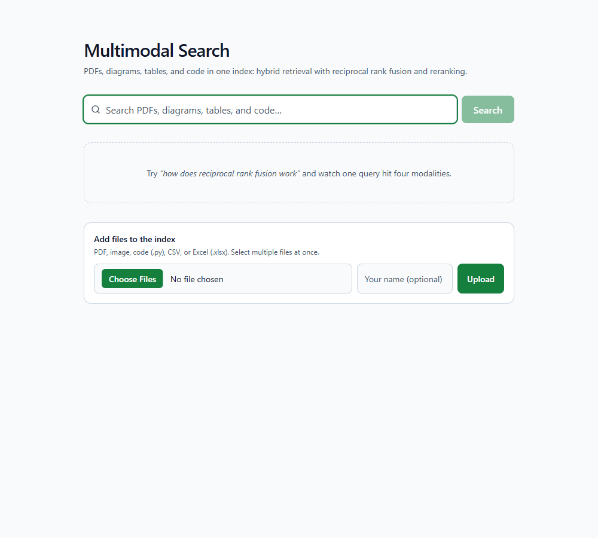
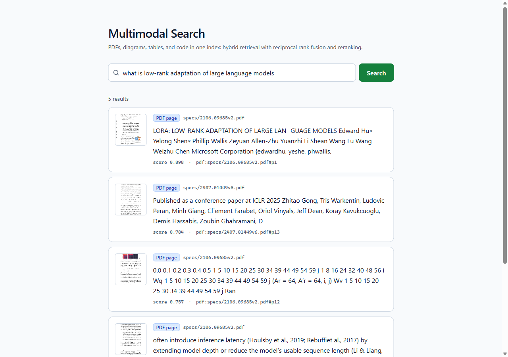
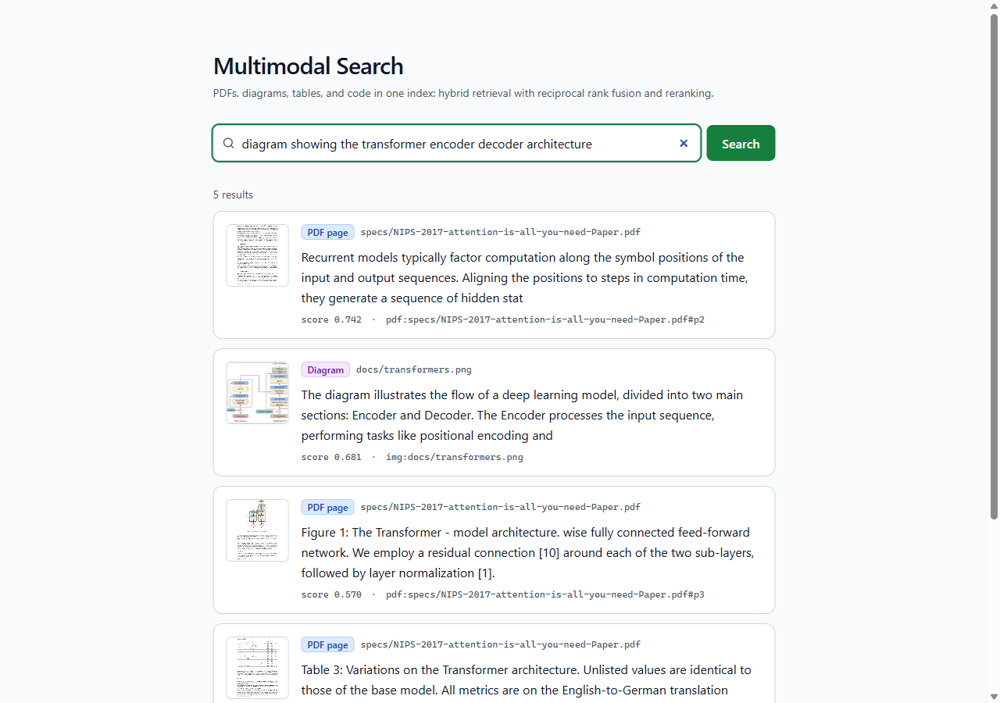
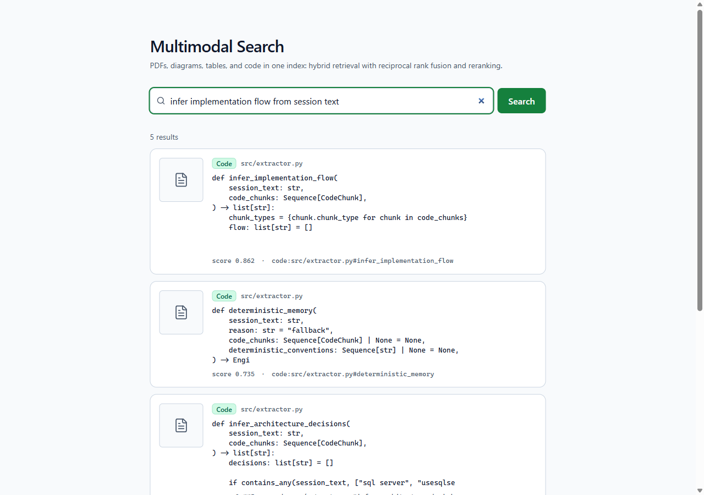
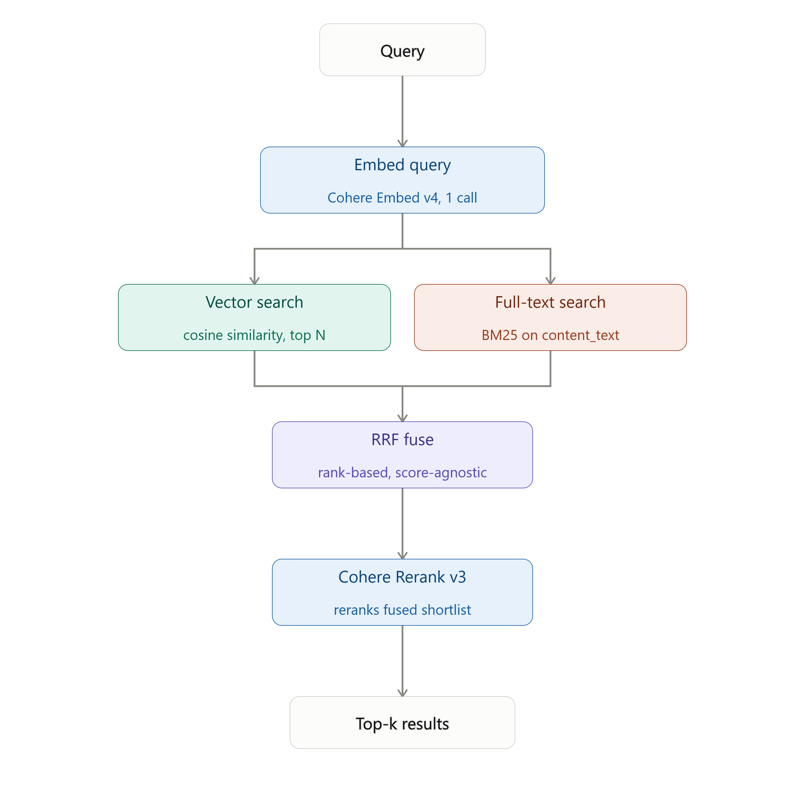

# Multimodal Search for Engineers


A search system that unifies PDFs, diagrams, tables, and code into **one
searchable index**: two embedding spaces (Cohere Embed v4 for page/diagram
*images*, OpenAI text-embedding-3-small for table/code/caption *text*), one
LanceDB table, hybrid retrieval (two vector retrievers + full-text, fused via
RRF) with Cohere Rerank v3 on top. Built to answer a question a
single-modality search tool can't: "which of my papers, diagrams,
spreadsheets, and source files actually talks about this," in one query.
The UI also supports uploading new files (PDF, image, code, CSV, Excel)
directly into the live index -- see [Uploading files](#uploading-files).

## Screenshots

The idle search page, with the upload panel below it:



A PDF result for "what is low-rank adaptation of large language models":



A diagram result with its thumbnail, for "diagram showing the transformer
encoder decoder architecture":



A code result with the mono snippet, for "infer implementation flow from
session text":



## Architecture at a glance



Query → embed with both providers (Cohere text query-embed, OpenAI text
query-embed) → two vector searches + full-text search (all three against the
same LanceDB table) → three-way Reciprocal Rank Fusion → Cohere Rerank v3 →
top-k results with thumbnails. PDFs and diagrams are embedded as *images*
(ColPali-style, single-vector, Cohere Embed v4) rather than OCR'd text;
diagrams and scanned pages also get a second OpenAI vector over their
VLM caption text. Tables are serialized to markdown and capped at 200 rows;
code is chunked by tree-sitter symbol boundaries (function/class), not
fixed-size splits -- both embedded via OpenAI text-embedding-3-small.
Text-less images (diagrams, scanned pages) get a moondream2-generated
caption so full-text search, the OpenAI vector, and reranking all have real
text to work with. Full design rationale is in [`PLAN.md`](PLAN.md) and
[`EMBEDDING_MIGRATION_PLAN.md`](EMBEDDING_MIGRATION_PLAN.md).

## Setup

```
pip install -e ".[dev]"
```

Build the frontend (requires Node 20+). The UI is a React + Vite app in
[`frontend/`](frontend); its build output is gitignored, so **a fresh clone
serves nothing at `/ui` until this runs**:

```
cd frontend && npm install && npm run build
```

That emits into `src/mmsearch/api/static/`, which FastAPI already serves: no
separate frontend server in production. Design rationale and the dev-server
workflow are in [`FRONTEND_PLAN.md`](FRONTEND_PLAN.md).

Create `.env` at the repo root (see [`.env.example`](.env.example)):

```
COHERE_API_KEY=your-key-here
OPENAI_API_KEY=your-key-here
MMSEARCH_API_KEY=your-own-shared-secret-here
```

`MMSEARCH_API_KEY` gates `/search` and `/thumbnails` -- generate one with:

```
python -c "import secrets; print(secrets.token_urlsafe(32))"
```

The server won't start without it. Opening `/ui` in a browser prompts for the
key on first search and remembers it (`localStorage` + a cookie, so both
`fetch` calls and ``-loaded thumbnails authenticate); calling `/search`
directly needs an `X-API-Key: <key>` header, e.g.:

```
curl -H "X-API-Key: your-own-shared-secret-here" "http://127.0.0.1:8000/search?q=auth"
```

Populate `corpus/` with your own PDFs (`specs/`), diagrams (`docs/`),
tables (`data/`), and code (`src/`). Three files are gitignored by license
or size rather than committed. See [`corpus/README.md`](corpus/README.md)
for exactly which ones, why, and where to source them.

## Running it

```
python -m mmsearch.ingest.cli ingest corpus/
uvicorn mmsearch.api.server:app --host 127.0.0.1 --port 8000
```

Open **http://127.0.0.1:8000/ui** and search. (If that page is blank or 404s,
the frontend build step above hasn't been run.)

To iterate on the UI itself, run Vite's dev server alongside uvicorn. It proxies
`/search` and `/thumbnails` to port 8000 and gives hot reload:

```
cd frontend && npm run dev      # http://127.0.0.1:5173
```

## Uploading files

The UI's "Add files to the index" panel (below the search box) lets you add
new files to the live index without re-running the ingest CLI: PDF, image
(`.png`/`.jpg`/`.jpeg`/`.gif`/`.bmp`), code (`.py`), CSV, or Excel (`.xlsx`),
one or several at a time. Behind it, `POST /upload` (same `X-API-Key` gate as
`/search`, its own rate limit -- 20 uploads/min, separate from search's
limit) validates each file's actual content against its extension (magic
bytes for binary types, decodability for `.py`/`.csv`) rather than trusting
the filename, caps uploads at 10 MB, and routes it through the same
per-modality ingestion path as the CLI (PDF page rasterization + text-layer
extraction, tree-sitter code chunking, CSV/xlsx-to-markdown, VLM captioning
for images) before upserting it into the same LanceDB table `/search`
queries:

```
curl -H "X-API-Key: your-own-shared-secret-here" \
     -F "file=@paper.pdf" -F "uploader=you" \
     http://127.0.0.1:8000/upload
```

Known gap: uploading the same file twice creates duplicate rows -- there's
no content-hash or id-collision check yet.

## Deployment

Deployed to Render as a read-only query service over the already-ingested
index -- ingestion stays local, where the API spend and (optionally) the GPU
already are. `data/lancedb` and `data/thumbnails` are committed to the repo
rather than kept on a persistent disk: they're a 9.8 MB build artifact, not
mutable state, and nothing on the query path writes to them. Full rationale,
the Render build/start commands, environment variables, cost breakdown, and
the security posture changes that come with being genuinely public are in
[`DEPLOYMENT_PLAN.md`](DEPLOYMENT_PLAN.md).

## Eval results

Hit-rate@5 and false-positive-rate against 24 positive + 5 negative labels
([`eval/labels.yaml`](src/mmsearch/eval/labels.yaml)) on the real committed
corpus, measured with the eval harness's own CLI (`mmsearch-eval`,
[`src/mmsearch/eval/cli.py`](src/mmsearch/eval/cli.py) -- `--out` for JSON
reports, `--compare` to diff two runs, `--ablations` for all three modes):

| | vector-only | rrf-only | rrf+rerank |
|---|---|---|---|
| **hit-rate@5** | 0.958 | 0.958 | **0.917** |
| **false-positive-rate** | 1.000 | 1.000 | **0.200** |

Per-modality, `rrf+rerank` (the only mode `/search` actually serves): code
1.000, diagram 0.800, pdf_page 0.600, table 1.000. `vector-only`/`rrf-only`
have no reranker to catch a confidently-wrong candidate, hence the much
higher false-positive-rate -- see [Known limitations](#known-limitations).

Two structural bugs were found and fixed by diffing these numbers
before/after each change (`mmsearch-eval --compare`; full trace in
`HANDOFF.md`):

- **42 of 76 rows -- every text-layer PDF page -- had no OpenAI text
  vector.** `ingest_pdf` embedded every page's raster into the Cohere
  vector but only ever embedded text into the OpenAI vector for
  scanned/captioned pages. Backfilled; zero change to `rrf+rerank` (the
  reranker already rescued these rows), but it surfaced the next bug.
- **`reciprocal_rank_fusion` summed scores across every list an id
  appeared in, with no normalization for how many lists it could
  structurally appear in.** A `pdf_page`/`diagram` row can appear in both
  vector lists; `code`/`table` only ever has one. The plain sum rewarded
  that extra list presence regardless of rank -- traced concretely, a code
  row ranking #1 in its only eligible list dropped to rank 17 after
  fusion. Fixed via an `eligible_universes` parameter on
  `reciprocal_rank_fusion` (`retrieve/fusion.py`) that normalizes by
  structural eligibility, not raw list count. `vector-only`/`rrf-only`
  hit-rate@5 recovered 0.333/0.542 -> 0.958/0.958; `rrf+rerank` was
  unaffected (0 flipped queries).

## Known limitations

The findings below were re-checked against the real current index (raw
per-retriever ranks, not just final top-5) rather than assumed to still
hold from an earlier measurement.

**Reranking can demote a correct top-ranked PDF page.** *(Still
reproduces, and no longer explainable by a missing retrieval signal.)* For
the query `"how to fine-tune an LLM for free using a Kaggle GPU"`, both
`vector-only` and `rrf-only` correctly rank the paper's actual intro page
(`p1`) at rank 1, but `rrf+rerank` drops it out of the top 5 entirely, in
favor of denser mid-document pages that share more surface vocabulary with
the query. This is the one case on this eval set where reranking looks
like a genuine regression, not a small-sample fluke: the correct page and
the promoted pages are all topically relevant, but the reranker's judgment
of "most relevant" doesn't match the eval label's ground truth for a
tutorial-style document where the intro page is mostly setup rather than
dense keyword content. This page's `vector_openai` used to be unset
(text-layer PDF pages had no OpenAI vector before it was backfilled) --
every page now has one, so a missing retrieval signal is no longer the
explanation. The reranker demotes the correct page anyway: this is
squarely a reranker-judgment issue, not a retrieval one.

**One residual false positive: a confidently-wrong reranker, not something
a score threshold can catch.** *(Open, not addressed.)* Of the 5 negative
labels (queries with no correct answer anywhere in the corpus), 4 correctly
return nothing above `MIN_SCORE_THRESHOLD`. The fifth -- "low-rank
adaptation of large language models," a topic genuinely absent from the
committed index -- surfaces the ColPali paper at a relevance score of 0.84.
`MIN_SCORE_THRESHOLD` only filters genuine low-confidence noise; it can't
fix a reranker that's confidently wrong about an irrelevant candidate. A
real fix needs a different mechanism than a score cutoff.

**Sparse-text modalities losing fusion ties to dense-text competitors --
not currently observed.** *(Original failure mode doesn't reproduce.)* The
original diagnosis: RRF fuses by rank position, and when a diagram (a
caption's worth of text) competes against a full paper page (hundreds of
words) for the same query, the page tends to rank consistently well across
*both* the vector and full-text lists while the diagram is merely decent in
one -- RRF rewards consistency over strength-in-one-signal. Rechecked
directly against all 3 diagram-labeled eval queries: every one of them now
ranks **1st** in the Cohere-vector list, **1st** in the OpenAI-vector list,
**and** 1st in full-text search, landing at rank 1 in the final `rrf-only`
fusion too. The likely reason this specific failure mode is gone: diagrams
now get a second, OpenAI-embedded vector over their VLM caption text -- a
dense-text retrieval signal that didn't exist under the old single
Cohere-image-space system. That gives diagrams a competitive edge in one
more retriever, which is exactly what the original diagnosis says they were
missing. The general structural point (rank-based fusion *can* penalize a
thin-text candidate against a verbose one) is still true in principle; it
just isn't manifesting on the current corpus and label set.

**Cross-modal diagram search sensitivity to query phrasing -- same symptom,
different cause now.** The formal eval label
`"diagram showing the transformer encoder decoder architecture"` correctly
surfaces the right diagram at rank 1 across every retriever. The original
claim used a shorter, ad hoc probe (not one of the scored labels):
`"transformers architecture"` previously failed to surface the diagram at
all. Rechecked: it's no longer a pure vector-retrieval failure -- the
OpenAI caption vector actually ranks the diagram **1st** for this phrasing,
which rescues it into `rrf-only`'s top 5 (rank 3). But it's still **absent**
from `rrf+rerank`'s top 5, the mode that actually serves `/search`: the
reranker itself now demotes it, despite the retrieval signal being strong.
So the end-user-visible symptom is unchanged (short, casual diagram queries
still don't reliably surface the diagram in production), but the mechanism
moved from "the vector embedding doesn't understand casual phrasing" to
"the reranker doesn't rate the caption as relevant enough," which is a
different problem with a different fix (reranker prompt/model tuning, not
an embedding change).

## Tests

433 tests, all green, all run against fakes/fixtures. No real API calls,
no torch/GPU load except when actually exercising the local captioner:

```
pytest
```
